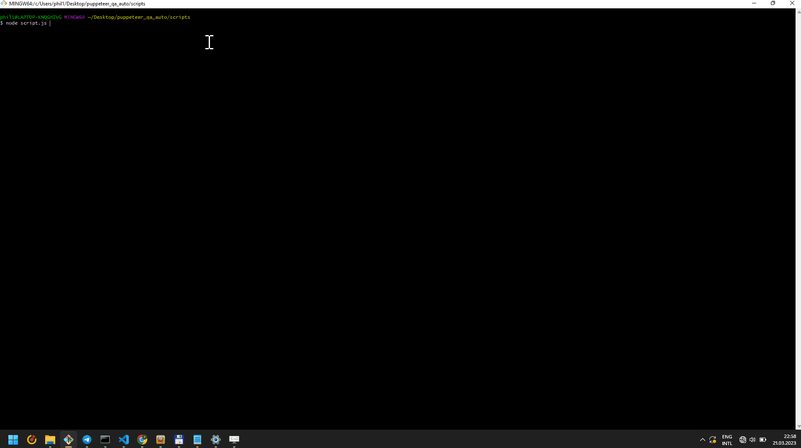

# puppeteer_router_customizer

## Проект представляет собой попытку использования библиотеки Puppeteer для настройки L2TP-соединения на роутере Mercusys AC10 с целью изучения возможностей фреймворка

- представление роутера выполнено с использованием паттерна Page Object Model
- используется CLI для предварительного ввода данных для настройки роутера

